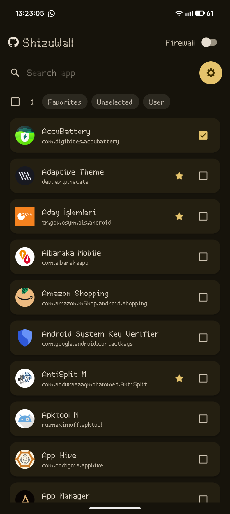

# ShizuWall


A lightweight, privacy focused Android firewall application that blocks network connections for selected apps **without requiring root access or VPN**. ShizuWall leverages Shizuku to provide powerful network control capabilities. Requires Android 11 (API 30) or higher. 

## ShizuWall is available on PlayStore!
### [Download from PlayStore](https://play.google.com/store/apps/details?id=com.arslan.shizuwall) 

#### PlayStore and GitHub versions are signed with different keys. These two versions DOES NOT have any difference on usability and functionality.

<p align="center">
  
  
  
</p>

<p align="center">
  <a href="https://www.buymeacoffee.com/ahmetcanarslan">
    
  </a>
</p>

## Why ShizuWall is Different

1. **Shizuku-Only Approach**: Most Android firewalls require either Root access or a VPN service. ShizuWall uses **only Shizuku**, providing native system-level control without the common VPN drawbacks.
2. **Per-app System Networking Control**: Uses Android's `connectivity` service (chain-3) via Shizuku to enable/disable networking on a per-app basis — no packet interception, no VPN tunnel.
3. **Privacy-first Design**: The app is offline-first and does not phone home. There is no analytics, no tracking and no telemetry.


## Notes

- Firewall rules are applied using platform commands and are automatically cleared on device reboot (Android security limitation). That means, rebooting will revert anything done by ShizuWall.
- No network calls from the app itself — it does not send any data to external services. ShizuWall does not request android.permission.INTERNET in its manifest. While Shizuku itself has shell privileges (which include network access), ShizuWall is designed to operate locally and does not initiate any network connections.

## Firewall Implementation

(what the app runs via Shizuku)

```bash
# Enable firewall framework
cmd connectivity set-chain3-enabled true

# Block specific app
cmd connectivity set-package-networking-enabled false <package.name>

# Unblock specific app
cmd connectivity set-package-networking-enabled true <package.name>

# Disable firewall framework
cmd connectivity set-chain3-enabled false
```

## Control via broadcast (adb / automation)

ShizuWall supports a simple broadcast interface so you can enable/disable the firewall from adb or automation tools.

```bash
- Action: shizuwall.CONTROL
- Component: com.arslan.shizuwall/.FirewallControlReceiver
- Extras:
  - state (boolean) — true = enable, false = disable
  - apps (string, optional) — comma-separated package list to operate on. If omitted the app falls back to the saved "selected apps" set.

Examples:

- Enable firewall for selected apps:
adb shell am broadcast -a shizuwall.CONTROL -n com.arslan.shizuwall/.FirewallControlReceiver --ez state true

- Disable firewall for selected apps
adb shell am broadcast -a shizuwall.CONTROL -n com.arslan.shizuwall/.FirewallControlReceiver --ez state false


- Enable firewall for specific packages (CSV):
adb shell am broadcast -a shizuwall.CONTROL -n com.arslan.shizuwall/.FirewallControlReceiver --ez state true --es apps "com.example.app1,com.example.app2"

- Disable firewall for specific packages:
adb shell am broadcast -a shizuwall.CONTROL -n com.arslan.shizuwall/.FirewallControlReceiver --ez state false --es apps "com.example.app1,com.example.app2"

```

- Shizuku must be running and the app must have Shizuku permission for these broadcasts to succeed.

## ⚠️ Disclaimer

This application requires Shizuku to function. The developer is not responsible for any issues arising from:
- Shizuku usage or configuration
- Network blocking affecting system functionality
- Data loss or service disruption
- Any negative consequences mentioned in the onboarding process

Use at your own discretion and ensure you understand which apps you're blocking.


## 📄 License

*This project is Licenced under GNU General Public License v3.0 (GPLv3).*

## 🤝 Contributing

Contributions, issues, and feature requests are welcome! Please see the repository for contribution guidelines.

## Donate

If you find ShizuWall useful, consider [Buy Me a Coffee](https://buymeacoffee.com/ahmetcanarslan) or downloading it from [PlayStore](https://play.google.com/store/apps/details?id=com.arslan.shizuwall)


### [Releases](https://github.com/AhmetCanArslan/ShizuWall/releases)

---

- [Shizuku](https://github.com/RikkaApps/Shizuku) - For providing the API that makes this app possible