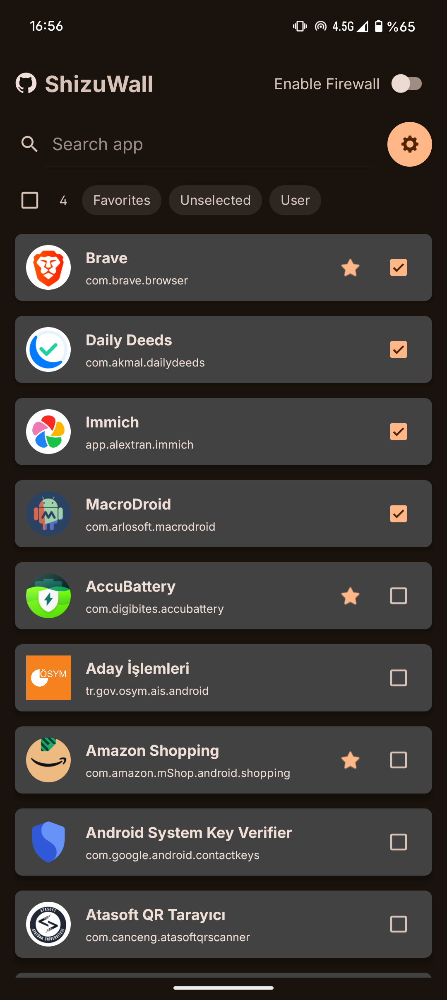
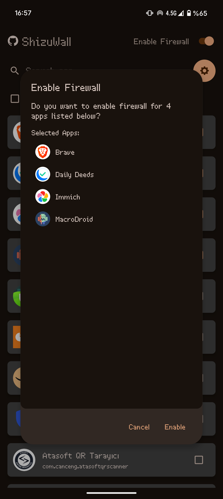
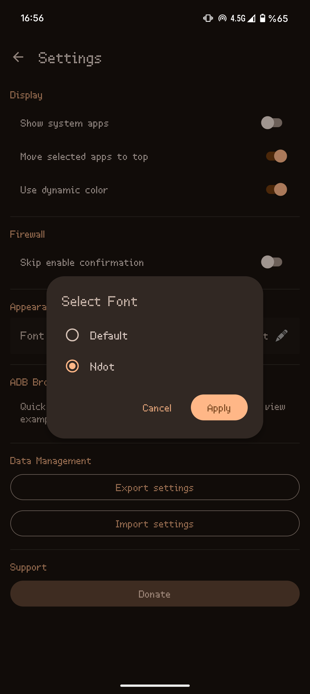

# ShizuWall


A lightweight, privacy focused Android firewall application that blocks network connections for selected apps **without requiring root access or VPN**. ShizuWall leverages Shizuku to provide powerful network control capabilities. Requires Android 11 (API 30) or higher. 

### [Download from releases](https://github.com/ahmetcanarslan/shizuwall/releases) 

<p align="center">
  
  
  
</p>

<p align="center">
  <a href="https://www.buymeacoffee.com/ahmetcanarslan">
    
  </a>
</p>

## Why ShizuWall is Different

1. **Shizuku-Only Approach**: Most Android firewalls require either Root access or a VPN service. ShizuWall uses **only Shizuku**, providing native system-level control without the common VPN drawbacks.
2. **Per-app System Networking Control**: Uses Android's `connectivity` service (chain-3) via Shizuku to enable/disable networking on a per-app basis — no packet interception, no VPN tunnel.
3. **Privacy-first Design**: The app is offline-first and does not phone home. There is no analytics, no tracking and no telemetry.


## Notes

- Firewall rules are applied using platform commands and are automatically cleared on device reboot (Android security limitation).
- The app detects reboots using a boot-relative timestamp and automatically clears stale saved state so you won't be left with stale "enabled" flags after reboot.
- By default only user-installed apps are shown. Use the overflow menu (three dots, top-right) to "Show system apps" if you need to include system apps for selection.
- If anything goes wrong, rebooting the device will revert every change made by ShizuWall.
- The app persists minimal preferences locally (selected apps, enabled flag) and stores a small boot-relative timestamp in device-protected storage so the app can detect reboots safely without exposing data.
- No network calls from the app itself — it does not send any data to external services and has no internet access.

## Firewall Implementation

(what the app runs via Shizuku)

```bash
# Enable firewall framework
cmd connectivity set-chain3-enabled true

# Block specific app
cmd connectivity set-package-networking-enabled false <package.name>

# Unblock specific app
cmd connectivity set-package-networking-enabled true <package.name>

# Disable firewall framework
cmd connectivity set-chain3-enabled false
```

## Control via broadcast (adb / automation)

ShizuWall supports a simple broadcast interface so you can enable/disable the firewall from adb or automation tools.

```bash
- Action: com.arslan.shizuwall.ACTION_FIREWALL_CONTROL
- Extras:
  - com.arslan.shizuwall.EXTRA_FIREWALL_ENABLED (boolean) — true = enable, false = disable
  - com.arslan.shizuwall.EXTRA_PACKAGES_CSV (string, optional) — comma-separated package list to operate on. If omitted the app falls back to the saved "selected apps" set.

Examples:

- Enable firewall for selected apps:
adb shell am broadcast -a com.arslan.shizuwall.ACTION_FIREWALL_CONTROL --ez com.arslan.shizuwall.EXTRA_FIREWALL_ENABLED true -p com.arslan.shizuwall

- Disable firewall for selected apps
adb shell am broadcast -a com.arslan.shizuwall.ACTION_FIREWALL_CONTROL --ez com.arslan.shizuwall.EXTRA_FIREWALL_ENABLED false -p com.arslan.shizuwall


- Enable firewall for specific packages (CSV):
adb shell am broadcast -a com.arslan.shizuwall.ACTION_FIREWALL_CONTROL --ez com.arslan.shizuwall.EXTRA_FIREWALL_ENABLED true --es com.arslan.shizuwall.EXTRA_PACKAGES_CSV "com.example.app1,com.example.app2" -p com.arslan.shizuwall

- Disable firewall for specific packages:
adb shell am broadcast -a com.arslan.shizuwall.ACTION_FIREWALL_CONTROL --ez com.arslan.shizuwall.EXTRA_FIREWALL_ENABLED false --es com.arslan.shizuwall.EXTRA_PACKAGES_CSV "com.example.app1,com.example.app2" -p com.arslan.shizuwall

```

Notes for those want to use broadcasts:
- The receiver is exported to allow adb and automation; prefer targeting the app explicitly with -p com.arslan.shizuwall to avoid accidental external broadcasts.
- Shizuku must be running and the app must have Shizuku permission for these broadcasts to succeed.
- The receiver applies the same commands as the UI (cmd connectivity ...). Use with care.

## ⚠️ Disclaimer

This application requires Shizuku to function. The developer is not responsible for any issues arising from:
- Shizuku usage or configuration
- Network blocking affecting system functionality
- Data loss or service disruption
- Any negative consequences mentioned in the onboarding process

Use at your own discretion and ensure you understand which apps you're blocking.


## 📄 License

*This project is Licenced under GNU General Public License v3.0 (GPLv3).*

## 🤝 Contributing

Contributions, issues, and feature requests are welcome! Please see the repository for contribution guidelines.

---

- [Shizuku](https://github.com/RikkaApps/Shizuku) - For providing the API that makes this app possible

## Donate

If you find ShizuWall useful, consider buying me a coffee: [Buy Me a Coffee](https://buymeacoffee.com/ahmetcanarslan)