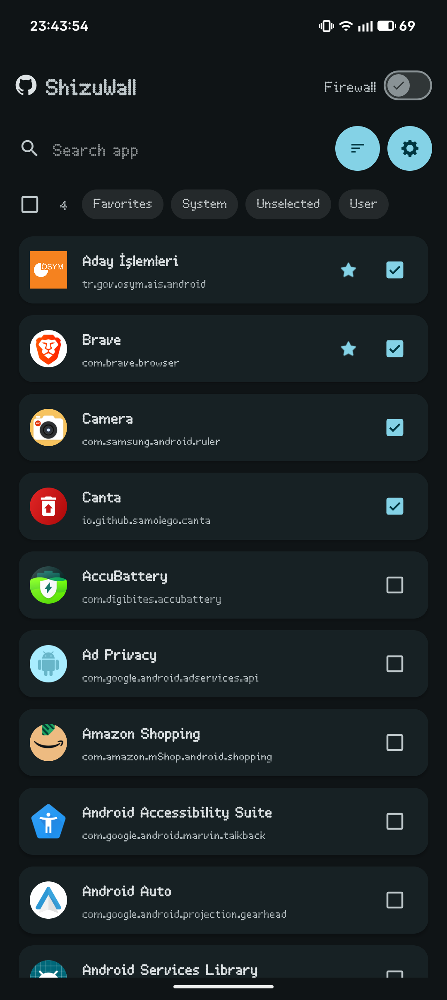
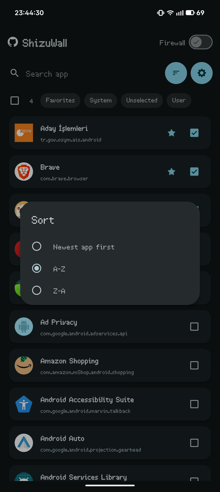
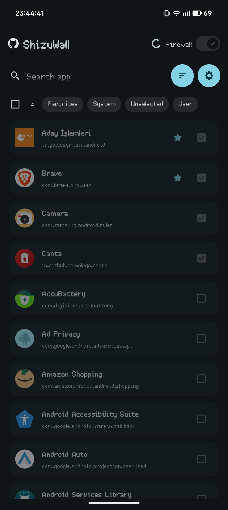
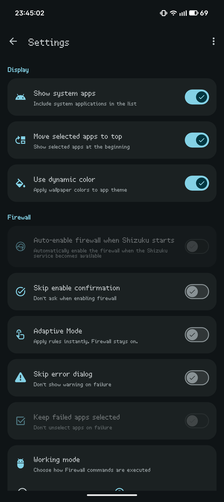
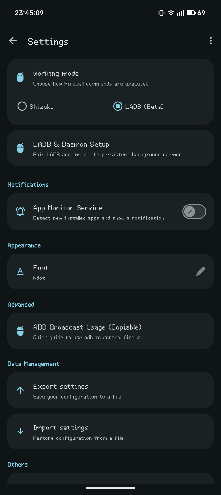
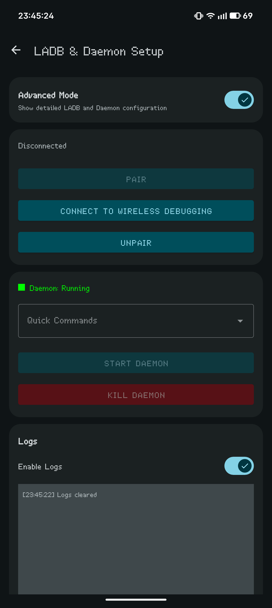
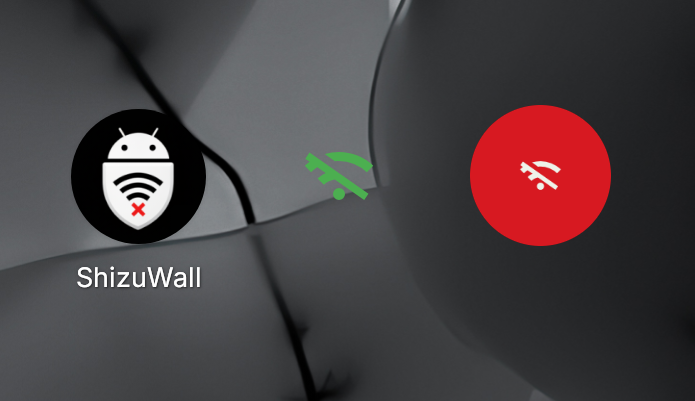

# ShizuWall

A lightweight, privacy focused Android firewall application that blocks network connections for selected apps **without requiring root access or VPN**. ShizuWall leverages Shizuku and libADB to provide powerful network control capabilities. Requires Android 11 (API 30) or higher. 

<div align="center">
  
  
</div>

<div align="center">  
<a href="https://github.com/AhmetCanArslan/ShizuWall/releases">
    
  </a>
  <br>
  <a href="https://github.com/AhmetCanArslan/ShizuWall/stargazers">
    
  </a>
  <br>
  <a href="https://play.google.com/store/apps/details?id=com.arslan.shizuwall">
  
</a>

<p align="center">
  <a href="https://www.buymeacoffee.com/ahmetcanarslan">
    
  </a>
</p>
</div>


## Screenshots
<p align="center">
  
  
  
  
  
  
  
</p>


## Why ShizuWall is Different

1. **No Root or VPN Required**: Most Android firewalls require either Root access or a VPN service. ShizuWall uses **Shizuku or a local ADB daemon**, providing native system-level control without the common VPN drawbacks.
2. **Per-app System Networking Control**: Uses Android's `connectivity` service (chain-3) to enable/disable networking on a per-app basis — no packet interception, no VPN tunnel.
3. **Privacy-first Design**: The app is offline-first and does not phone home. There is no analytics, no tracking and no telemetry.


## Notes

- Firewall rules are applied using platform commands and are automatically cleared on device reboot (Android security limitation).That means, rebooting will revert anything done by ShizuWall.

- No network calls from the app itself — it does not send any data to external services. The application requests `android.permission.INTERNET` permission to only support wireless debugging pairing (LibADB) features (connecting to the local ADB daemon). ShizuWall is designed to operate locally and does not initiate any connections to external servers.

## Firewall Implementation

(what the app runs via Shizuku or the local daemon)

```bash
# Enable firewall framework
cmd connectivity set-chain3-enabled true

# Block specific app
cmd connectivity set-package-networking-enabled false <package.name>

# Unblock specific app
cmd connectivity set-package-networking-enabled true <package.name>

# Disable firewall framework
cmd connectivity set-chain3-enabled false
```

## Control via broadcast (adb / automation)

ShizuWall supports a simple broadcast interface so you can enable/disable the firewall from adb or automation tools.

```bash
- Action: shizuwall.CONTROL
- Component: com.arslan.shizuwall/.receivers.FirewallControlReceiver
- Extras:
  - state (boolean) — true = enable, false = disable
  - apps (string, optional) — comma-separated package list to operate on. If omitted the app falls back to the saved "selected apps" set.

Examples:

- Enable firewall for selected apps:
adb shell am broadcast -a shizuwall.CONTROL -n com.arslan.shizuwall/.receivers.FirewallControlReceiver --ez state true

- Disable firewall for selected apps
adb shell am broadcast -a shizuwall.CONTROL -n com.arslan.shizuwall/.receivers.FirewallControlReceiver --ez state false


- Enable firewall for specific packages (CSV):
adb shell am broadcast -a shizuwall.CONTROL -n com.arslan.shizuwall/.receivers.FirewallControlReceiver --ez state true --es apps "com.example.app1,com.example.app2"

- Disable firewall for specific packages:
adb shell am broadcast -a shizuwall.CONTROL -n com.arslan.shizuwall/.receivers.FirewallControlReceiver --ez state false --es apps "com.example.app1,com.example.app2"

```

- Shizuku or the local daemon must be running for these broadcasts to succeed.

## ⚠️ Disclaimer

**ShizuWall is provided "as is" without warranty of any kind.** By using this application, you acknowledge that it requires advanced system permissions (Shizuku/ADB) and you use it at your own risk.

The developer is **not responsible** for any damages, including but not limited to:

- System instability, data loss, or service disruption.
- Network blocking affecting critical system functionality.
- Any consequences arising from the use of Shizuku or ADB.

**Always ensure you understand which apps you are blocking. Use at your own discretion.**

## Compiling the Daemon (For Developers)

The ShizuWall daemon is a lightweight Java-based service that runs on the device to handle system-level firewall commands. It is compiled into a DEX file and stored as `app/src/main/assets/daemon.bin`.

### Prerequisites

- Android SDK
- Java 11
- `d8` tool (part of Android Build Tools)
- Compilation script located at `scripts/compile_daemon.sh`

#### Using the script

1. Open [scripts/compile_daemon.sh](scripts/compile_daemon.sh).
2. Update `SDK_PATH`, `BUILD_TOOLS_VER`, and `PLATFORM_VER` to match your environment.
3. Run the script:
   ```bash
   chmod +x scripts/compile_daemon.sh
   ./scripts/compile_daemon.sh
   ```

## 📄 License

*This project is Licenced under GNU General Public License v3.0 (GPLv3).*


## Donate

If you find ShizuWall useful, consider [Buying Me a Coffee](https://buymeacoffee.com/ahmetcanarslan) or downloading it from [PlayStore](https://play.google.com/store/apps/details?id=com.arslan.shizuwall)

## [Releases](https://github.com/AhmetCanArslan/ShizuWall/releases)

- [Shizuku](https://github.com/RikkaApps/Shizuku) - For providing the API that makes this app possible
- [LibADB](https://github.com/MuntashirAkon/libadb-android) - For wireless debugging support that makes adb connection and Daemon management easier
