<div align="center">
  <a href="https://play.google.com/store/apps/details?id=com.arslan.shizuwall">
    
  </a>
  <h1>ShizuWall</h1>
  <strong>جدار حماية لأندرويد بدون VPN.</strong><br/>
  الخصوصية أولاً، محلي بالكامل، يعمل عبر Shizuku / خدمة ADB المحلية / الروت.
</div>

<p align="center">
  <a href="../README.md">English</a> ·
  <a href="README.tr.md">Türkçe</a> ·
  <a href="README.de.md">Deutsch</a> ·
  <a href="README.it.md">Italiano</a> ·
  <a href="README.pt.md">Português</a> ·
  <a href="README.cs.md">Čeština</a> ·
  <a href="README.ru.md">Русский</a> ·
  <b>العربية</b> ·
  <a href="README.hi.md">हिन्दी</a> ·
  <a href="README.zh.md">中文</a> ·
  <a href="README.ja.md">日本語</a>
</p>
<div style="height: 20px;">&nbsp;</div>
<p align="center">
  
  
  
  
  
  <a href="https://github.com/timschneeb/awesome-shizuku?tab=readme-ov-file#network">
    
  </a>
</p>

<p align="center">
  <a href="https://play.google.com/store/apps/details?id=com.arslan.shizuwall">
    
  </a>
  <a href="https://f-droid.org/packages/com.arslan.shizuwall/">
    
  </a>
</p>

<p align="center">
  <a href="https://www.buymeacoffee.com/ahmetcanarslan">
    
  </a>
</p>


## لماذا ShizuWall

- **بدون VPN**: يتجنّب اعتراض الحزم والآثار الجانبية لنفق VPN دائم.
- **تحكّم بالشبكة لكل تطبيق**: يشغّل ويوقف شبكة التطبيقات عبر أدوات chain-3 في `connectivity` في أندرويد.
- **خصوصية بالتصميم**: يعمل دون اتصال أولاً، بلا تحليلات ولا قياس عن بُعد ولا تتبّع.
- **جاهز للأتمتة**: يدعم أوامر `adb broadcast` للنصوص البرمجية وأتمتة المهام.
- **طرق التحكّم**: يوفّر ShizuWall ثلاث طرق عملية للتحكّم بجدار الحماية: مربّع الإعدادات السريعة، وأداة الشاشة الرئيسية، وزر جدار الحماية العائم.

## لقطات الشاشة

<p align="center">
  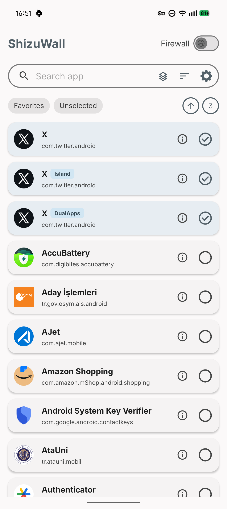
  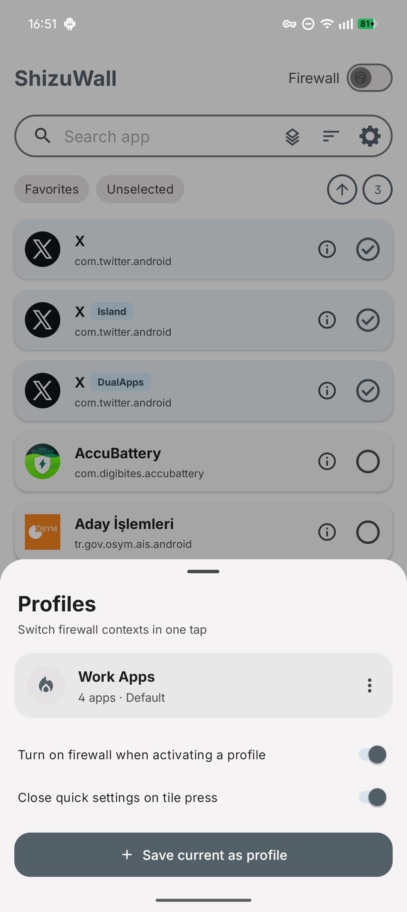
  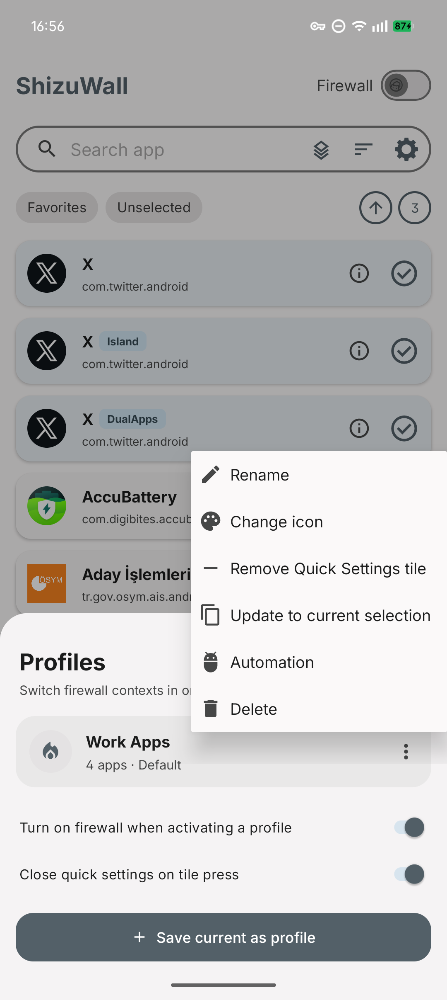
  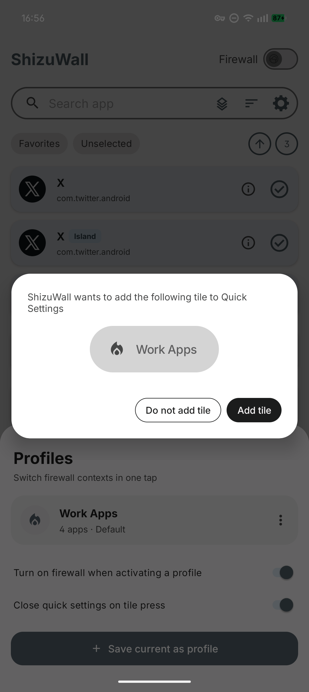
  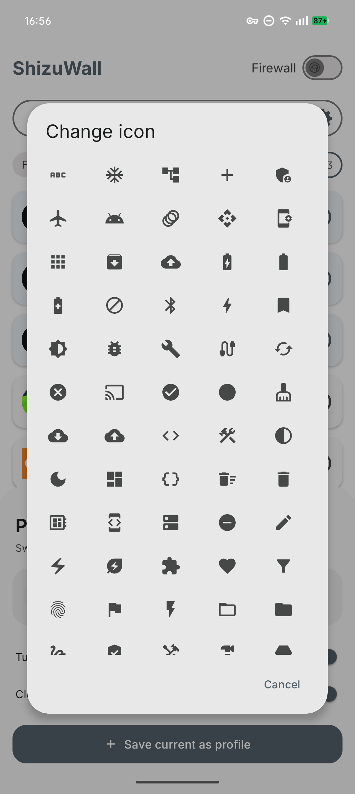
  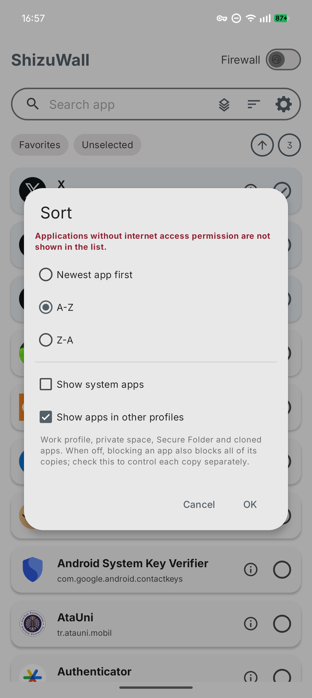
  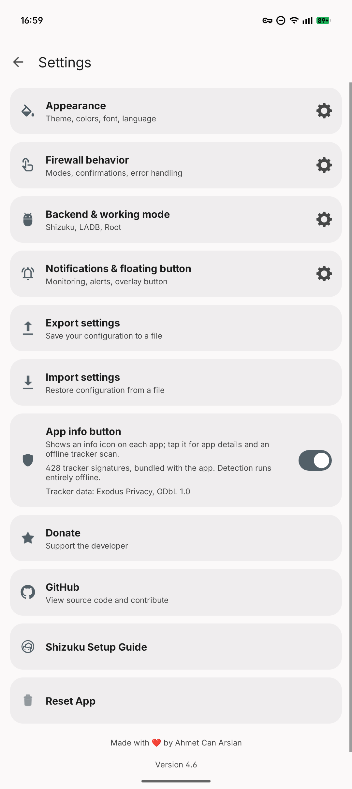
  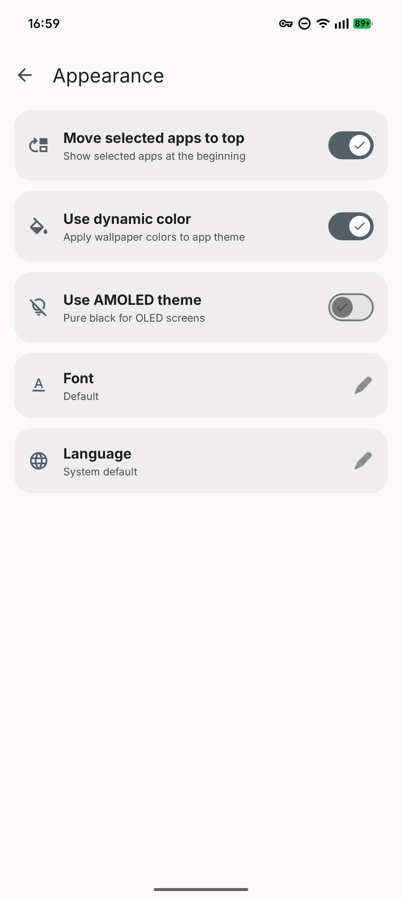
  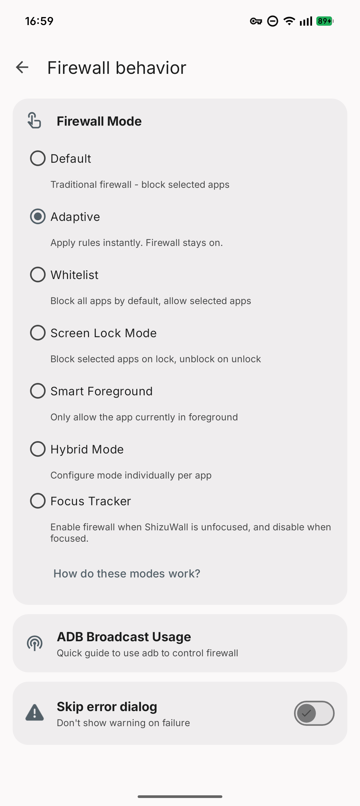
  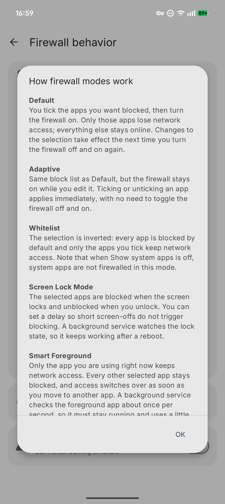
  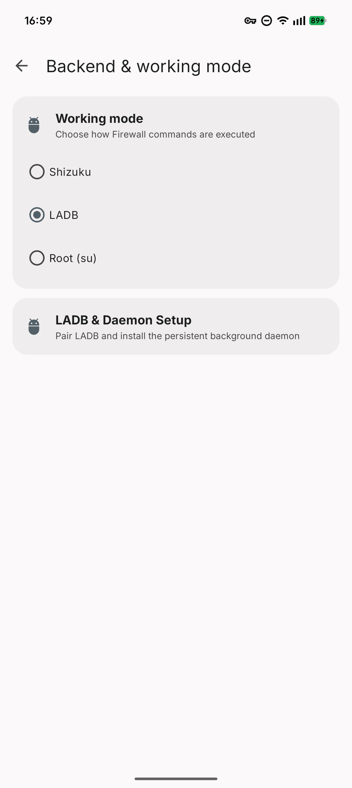
  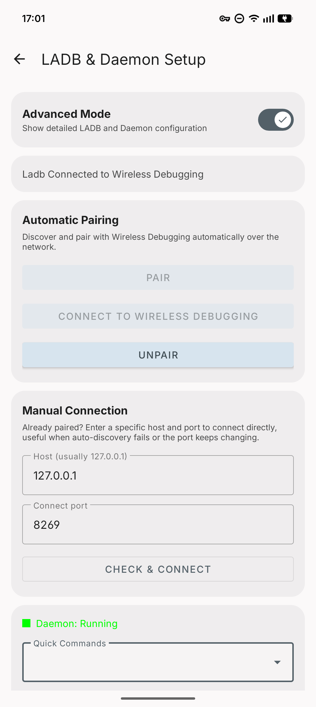
  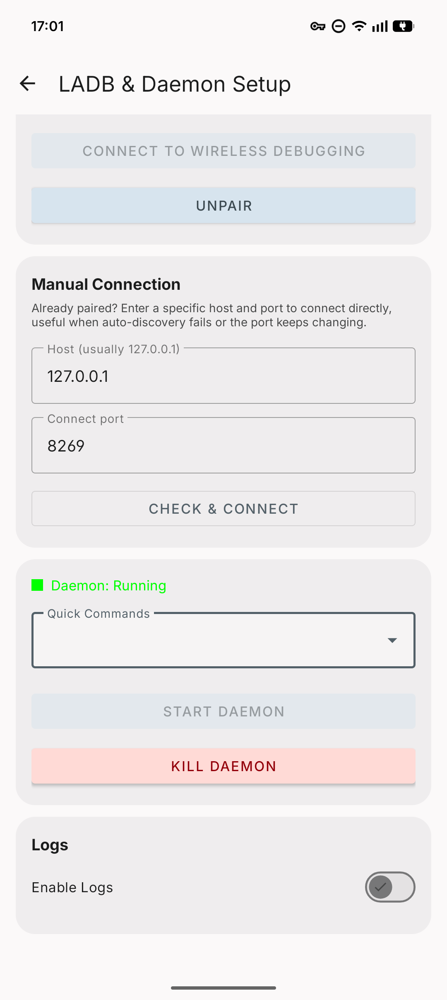
  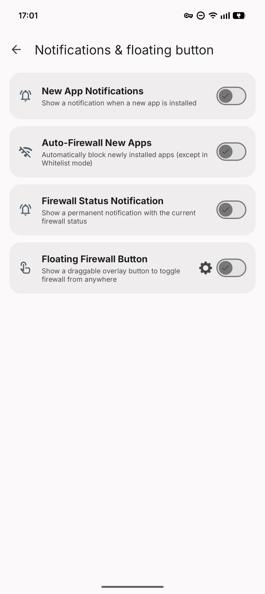
  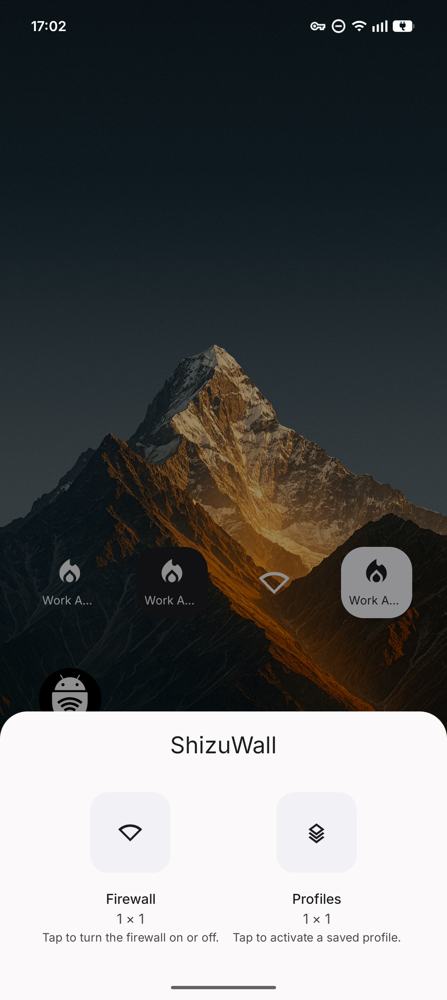
  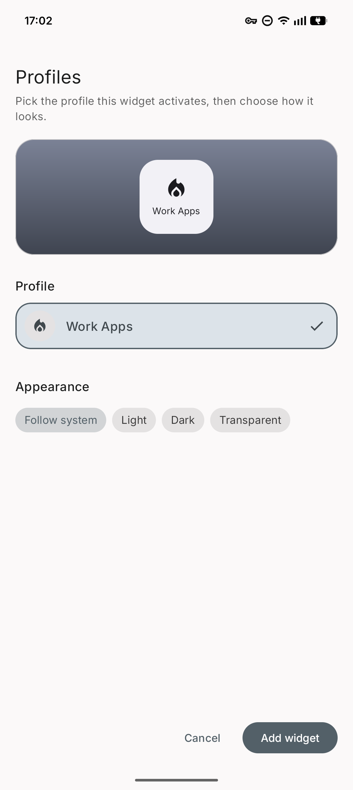

</p>

## المتطلبات

- أندرويد 11 (API 30) أو أحدث
- واجهة تحكّم واحدة: Shizuku أو خدمة ADB المحلية أو صلاحيات الروت

## واجهات التحكّم

يدعم ShizuWall ثلاث طرق لتنفيذ أوامر جدار الحماية:

| الطريقة | الوصف | الإعداد |
|--------|---------|---------|
| **Shizuku** | واجهة برمجية آمنة تتواصل مع خدمات النظام. تتطلّب تطبيق Shizuku. النسخ المشتقّة مدعومة. | ثبّت تطبيق Shizuku وأعدّه وامنح الأذونات |
| **الروت** | وصول مباشر بصلاحيات الروت. | اعمل روت لجهازك بالطرق المعتادة |
| **LibADB (LADB)** | يستخدم ميزة «تصحيح الأخطاء اللاسلكي» المدمجة في هاتفك ليتصرّف كحاسوب موصول عبر USB. يتيح ذلك للتطبيق إجراء تغييرات متقدّمة في النظام دون حاجة إلى حاسوب أو روت أو تطبيقات إضافية مثل Shizuku. | فعّل تصحيح الأخطاء اللاسلكي وأجرِ الاقتران من خيارات المطوّر (الدليل داخل التطبيق) |

## كيف يعمل

يستخدم ShizuWall آلية **Chain 3** في أندرويد (سلسلة الاتصال) للتحكّم بشبكة كل تطبيق. هذه هي أوامر النظام التي تُنفَّذ عبر Shizuku أو الخدمة المحلية:

### أوامر ADB لـ Chain 3

```bash
# تفعيل إطار جدار الحماية
cmd connectivity set-chain3-enabled true

# حظر تطبيق محدّد
cmd connectivity set-package-networking-enabled false <package.name>

# رفع الحظر عن تطبيق محدّد
cmd connectivity set-package-networking-enabled true <package.name>

# تعطيل إطار جدار الحماية
cmd connectivity set-chain3-enabled false
```

**Chain 3** آلية في منصّة أندرويد تعترض وصول كل حزمة إلى الشبكة وتتحكّم به على مستوى النظام، ما يتيح تحكّماً دقيقاً بجدار الحماية.

## الأتمتة (بث ADB)

يمكنك التحكّم بـ ShizuWall من النصوص البرمجية وأدوات الأتمتة.

**الإجراء**: `shizuwall.CONTROL`  
**المكوّن**: `com.arslan.shizuwall/.receivers.FirewallControlReceiver`  

**المعطيات الإضافية**

- `state` (قيمة منطقية، مطلوبة): `true` = تفعيل، `false` = تعطيل
- `apps` (نص، اختيارية): قائمة حزم مفصولة بفواصل. إذا أُهملت، يستخدم ShizuWall التطبيقات المحدّدة المحفوظة.

### أمثلة

```bash
# تفعيل جدار الحماية للتطبيقات المحدّدة المحفوظة
adb shell am broadcast -a shizuwall.CONTROL -n com.arslan.shizuwall/.receivers.FirewallControlReceiver --ez state true

# تعطيل جدار الحماية للتطبيقات المحدّدة المحفوظة
adb shell am broadcast -a shizuwall.CONTROL -n com.arslan.shizuwall/.receivers.FirewallControlReceiver --ez state false

# تفعيل جدار الحماية لحزم محدّدة
adb shell am broadcast -a shizuwall.CONTROL -n com.arslan.shizuwall/.receivers.FirewallControlReceiver --ez state true --es apps "com.example.app1,com.example.app2"

# تعطيل جدار الحماية لحزم محدّدة
adb shell am broadcast -a shizuwall.CONTROL -n com.arslan.shizuwall/.receivers.FirewallControlReceiver --ez state false --es apps "com.example.app1,com.example.app2"
```

> يجب أن تكون إحدى واجهات التحكّم (Shizuku أو خدمة ADB المحلية أو الروت) نشطة حتى تنجح عمليات البث.

## ملاحظات وقيود

- تُمسح قواعد جدار الحماية عند إعادة التشغيل بسبب سلوك منصّة أندرويد.
- إعادة تشغيل الجهاز تُلغي أي حظر شبكي نشط طبّقه ShizuWall.
- يطلب التطبيق إذن `android.permission.INTERNET` فقط من أجل اقتران تصحيح الأخطاء اللاسلكي (الاتصال بخدمة LibADB المحلية).

## البناء (للمطوّرين)

### التطبيق

```bash
./gradlew assembleRelease
```

### الخدمة (Daemon)

تُترجَم الخدمة العاملة على الجهاز (`SystemDaemon.java`) إلى ملف DEX باسم (`daemon.bin`) تلقائياً ضمن بناء Gradle المعتاد عبر مهمة `compileDaemonDex`. تُبنى من المصدر باستخدام `javac` و`d8` من أدوات بناء Android SDK وتُحزم كأصل — لا يوجد ملف ثنائي جاهز في المستودع، لذا تنتجه خوادم البناء القابل لإعادة الإنتاج (مثل F-Droid) بنفسها.

لا حاجة إلى أي خطوة يدوية؛ الأمر `./gradlew assembleRelease` يبنيها أيضاً. ويمكن تشغيل المهمة وحدها:

```bash
./gradlew :app:compileDaemonDex
```

## إخلاء مسؤولية بشأن الأمان والتوزيع

يُقدَّم ShizuWall **«كما هو»** دون أي ضمان من أي نوع.

باستخدامك هذا التطبيق تقرّ بأنه يعتمد على أذونات نظام متقدّمة (Shizuku/ADB/الروت)، وتقبل جميع المخاطر المرتبطة بذلك. لا يتحمّل المطوّر مسؤولية أضرار مثل عدم استقرار النظام أو فقدان البيانات أو انقطاع الخدمات أو الآثار الجانبية لحظر الشبكة.

**التوزيع الرسمي ومخاطر الأطراف الثالثة**
لا يتحمّل مطوّرو ShizuWall والمساهمون فيه أي مسؤولية عن أضرار أو خروقات أمنية أو إصابات ببرمجيات خبيثة أو فقدان بيانات ناتجة عن تنزيل ملفات APK من مصادر خارجية أو تثبيتها أو استخدامها. يُطوَّر ShizuWall ويُوزَّع رسمياً حصراً عبر متجر Google Play ومستودعه الرسمي على GitHub وF-Droid. لا يملك ShizuWall أي موقع رسمي ولا يديره ولا يعتمده. أي موقع أو منصّة خارجية تدّعي تقديم تنزيلات رسمية لـ ShizuWall لا علاقة لها بالمشروع وغير مصرّح لها. ومن يحصل على التطبيق خارج القنوات الرسمية يفعل ذلك على مسؤوليته الكاملة.

**ShizuWall تطبيق مفتوح المصدر. لا يتحمّل المطوّر أي مسؤولية مالية أو أخلاقية أو قانونية عن استخدام هذا التطبيق. المسؤولية كاملة على المستخدم.**

تحقّق دائماً من التطبيقات التي تحظرها.

## الترخيص

مرخّص بموجب **GNU General Public License v3.0 (GPLv3)**. انظر [LICENSE.md](../LICENSE.md).

بيانات بصمات المتتبّعات المرفقة ليست شيفرة ولها ترخيصها الخاص (ODbL v1.0). انظر [TRACKER_DATA_LICENSE.md](../TRACKER_DATA_LICENSE.md).

## الدعم

- ⭐ ضع نجمة للمشروع: [GitHub Stars](https://github.com/AhmetCanArslan/ShizuWall/stargazers)
- ☕ تبرّع: [Buy Me a Coffee](https://buymeacoffee.com/ahmetcanarslan)
- ⬇️ نزّل التطبيق: [Google Play Store](https://play.google.com/store/apps/details?id=com.arslan.shizuwall)

## شكر وتقدير

- [Shizuku](https://github.com/RikkaApps/Shizuku) — واجهة برمجية تتيح تنفيذ الأوامر ذات الصلاحيات المرتفعة.
- [LibADB](https://github.com/MuntashirAkon/libadb-android) — دعم تصحيح الأخطاء اللاسلكي والاتصال بالخدمة.
- [Exodus Privacy](https://exodus-privacy.eu.org/) — قاعدة بيانات بصمات المتتبّعات المستخدمة للكشف عن حزم التتبّع داخل التطبيقات، مرخّصة بموجب [ODbL v1.0](https://opendatacommons.org/licenses/odbl/1-0/). يضمّ ShizuWall نسخة مختصرة منها ولا يتصل بواجهتها البرمجية إطلاقاً. انظر [TRACKER_DATA_LICENSE.md](../TRACKER_DATA_LICENSE.md).
